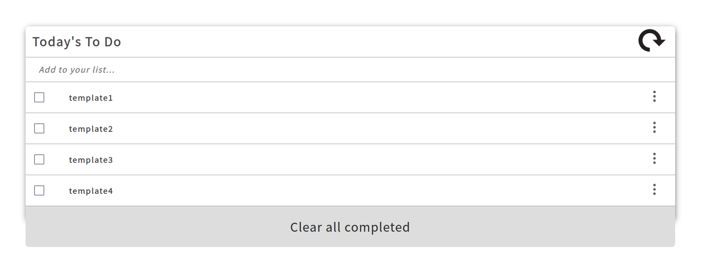

# Project Name

> Todo-list

# Table of content

- [Tech-stack](#Tech-stack)
- [Installation](#Installation)
- [Features](#Features)
- [Future_featues](#Future_featues)
- [Authors](#Authors)
- [Contribution](#Contribution)
- [Support](#Support)
- [Acknowledgments](#Acknowledgments)
- [License](#License)

This Website is a to-do-list project. A simple as it seems. You have your list of todos and whenever you finish one you can delete it. And then whenever you want to add a new one you can add it

## Built With 

- HTML, CSS, JavaScript
- Webpack
- VS Code

## Getting Started 

To get a local copy up and running follow these simple example steps.

### Prerequisites

- VSCODE / Live HTTP Server (./dist)

- OS with Git installed on it

### Setup

**Run** https://github.com/Goldinium/To_do_list_app.git

### Test

npm i jest

npm run test 

## Key Features 

- Display tasks and render them dynamically from JavaScript

## Future Features 

- Implementing remove & add buttons

- Implemeting interactivity 

## Authors 

👤 **Author1**

- GitHub: [@Goldinium](https://github.com/Goldinium)

## 🤝 Contributing 

Any contributing is welcome

Feel free to check the [issues page](https://github.com/Goldinium/To_do_list_app/issues).

## Show your support 

Give a ⭐️ if you like this project!

## Acknowledgments 

- This project belongs to [Microverse](https://microverse.org/).

## 📝 License 

- This project is [MIT](./Licenses/MIT.md) licensed.

